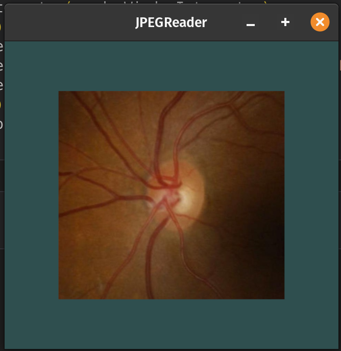
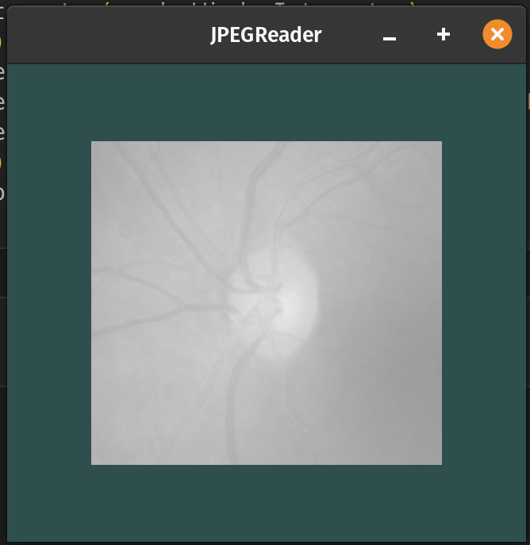

# trame
[Trame](https://kitware.github.io/trame/docs/index.html) tools and visualizations. An exploration.

## Sample Data
Dropbox (04_04_2024):
  * [REFUGE_Challenge_Splits_Downloaded](https://www.dropbox.com/scl/fo/05yez0zl3qd5j43bs0yyo/h?rlkey=hhhvsfobhzd9wvbue30hg81tu&dl=0)
  * [REFUGE_pure](https://www.dropbox.com/scl/fo/ihafmmi7xugainu2t4wgb/h?rlkey=v0luo9amqlobe1qtmkt5btzsi&dl=0)

## Docs here
[https://kitware.github.io/vtk-examples/site/](https://kitware.github.io/vtk-examples/site/)

## JPEG Reader
Hi Stephen, Jared and Sebastien,

I can read an image with the vtk.vtkJPEGReader method.

I used two files which accomplish the same exact thing:

* JPEGReader.py
* JPEGReader.ipynb

With these I can create the following image "JPEGReader_1.png" and in the interactor window use my mouse to create "JPEGReader_[2-4].png".

## JPEGReader_1.png

## JPEGReader_2.png

## JPEGReader_3.png

## JPEGReader_4.png
